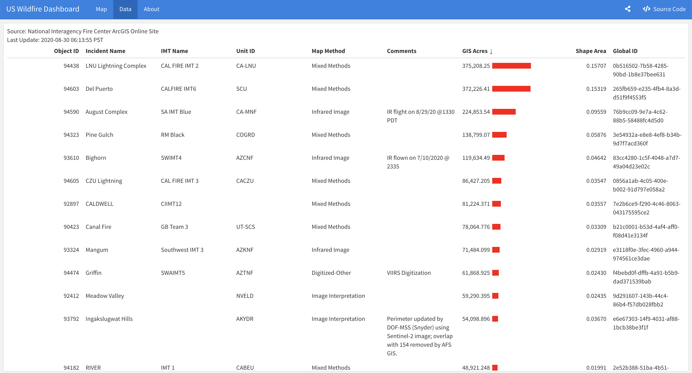

<!-- README.md is generated from README.Rmd. Please edit that file -->

# uswildfire

<!-- badges: start -->

<!-- badges: end -->

**The US Wildfire Dashboard**

The US Wildfire Dashboard provides a live update for the ongoing
wildfire in the US. This dashboard is built with R using
[Rmakrdown](https://rmarkdown.rstudio.com/) and
[flexdashboard](https://rmarkdown.rstudio.com/flexdashboard/) framework,
and can easily reproduce by others. The code behind the dashboard
available [here](https://github.com/RamiKrispin/uswildfire)




**Data**

The input data for this dashboard is the [National Interagency Fire
Center ArcGIS Online Site](https://data-nifc.opendata.arcgis.com/).

Data on the dashboard is refreshed hourly with [Github
Actions](https://github.com/RamiKrispin/uswildfire/blob/master/.github/workflows/data_refresh.yml),
where the raw data on the NIFC website is getting updated every few
hours.

**Packages**

  - Dashboard interface - the
    [flexdashboard](https://rmarkdown.rstudio.com/flexdashboard/)
    package.
  - Mapping - [leaflet](https://rstudio.github.io/leaflet/) for plotting
    the map and [sf](https://r-spatial.github.io/sf/index.html) packages
  - Data - [jsonlite](https://github.com/jeroen/jsonlite) for parsing
    the raw data
  - Tables - the [reactable](https://glin.github.io/reactable/) and
    [htmltools](https://github.com/rstudio/htmltools) packages

**Deployment and reproducibly**

The dashboard was deployed to Github docs. If you wish to deploy and/or
modify the dashboard on your Github account, you can apply the following
steps:

  - Fork the dashboard
    [repository](https://github.com/RamiKrispin/uswildfire), or
  - Clone it and push it to your Github package
  - Here some general guidance about deployment of flexdashboard on
    Github page -
    [link](https://github.com/pbatey/flexdashboard-example)

**Docker**

The supporting docker with the requirement packages for running this
dashboard is available
[here](https://hub.docker.com/repository/docker/rkrispin/us_wildfire).
To run the dashboard localy with RStudio follow the following steps:

  - Clone the the dashboard
    [repository](https://github.com/RamiKrispin/uswildfire)
  - Run the following docker:

<!-- end list -->

``` bash
docker run -p 8787:8787 -e PASSWORD='Your_Password' -e USER='Your_Username' -v ~/your_local_path  rkrispin/us_wildfire_rstudio:dev
```

Where the `Your Password` and `Your Username` above should replace with
the password and username you wish to set for the RStudio instance. The
`your_local_path` argument should replace with the local path of the
cloned dashboard on your machine. Once the docker is lunched, use on
your browser `http://localhost:8787` for login RStudio (using the
credential you set above) and access the dashboard on sub-folder
`uswildfire` and render the `index.Rmd` file to lunch the dashboard.

For any question or feedback, you can either open an
[issue](https://github.com/RamiKrispin/uswildfire/issues) or contact me
on [Twitter](https://twitter.com/Rami_Krispin).
